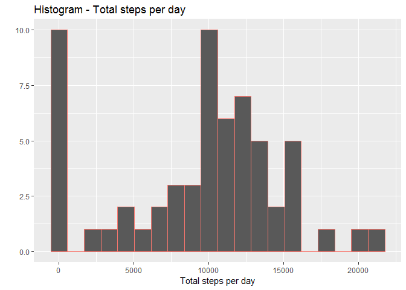
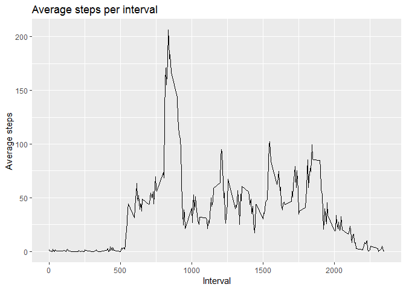
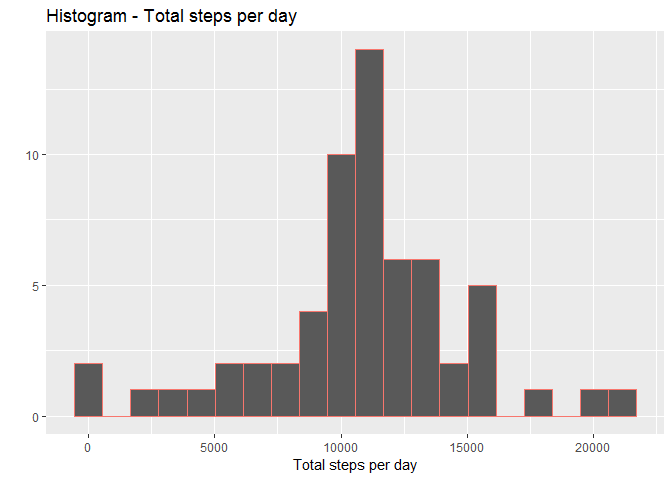
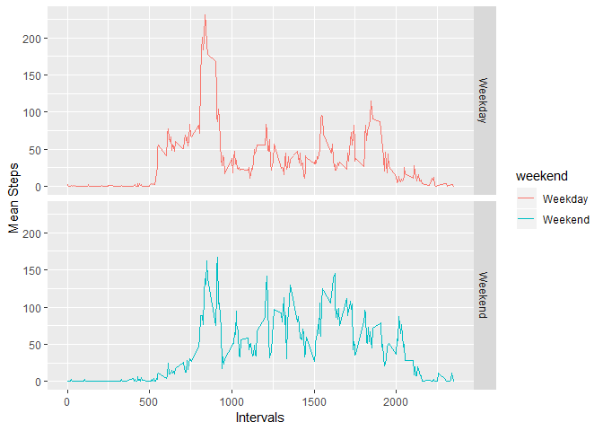

## Loading and preprocessing the data


```r
library(dplyr)
```

```
## 
## Attaching package: 'dplyr'
```

```
## The following objects are masked from 'package:stats':
## 
##     filter, lag
```

```
## The following objects are masked from 'package:base':
## 
##     intersect, setdiff, setequal, union
```

```r
library(ggplot2)

if(!file.exists("activity.zip")){
    download.file("https://d396qusza40orc.cloudfront.net/repdata%2Fdata%2Factivity.zip", 
                  destfile = "activity.zip")
    unzip("activity.zip")
}
raw_data <- read.csv("activity.csv")
head(raw_data)
```

```
##   steps       date interval
## 1    NA 2012-10-01        0
## 2    NA 2012-10-01        5
## 3    NA 2012-10-01       10
## 4    NA 2012-10-01       15
## 5    NA 2012-10-01       20
## 6    NA 2012-10-01       25
```

## What is mean total number of steps taken per day?

```r
by_dates <- raw_data %>% select(date, steps) %>% group_by(date) %>% summarize(total_steps = sum(steps, na.rm = T))

with(by_dates, qplot(total_steps, bins = 20, col = "red", geom = "histogram", main = "Histogram - Total steps per day", xlab = "Total steps per day") + theme(legend.position = "none"))
```

<!-- -->

```r
mean_steps <- round(x = mean(by_dates$total_steps, na.rm = T), digits = 2)
median_steps <- median(by_dates$total_steps, na.rm = T)
```

The mean steps per day is 9354.23 and the median is 10395.


## What is the average daily activity pattern?


```r
by_interval <- raw_data %>% select(interval, steps) %>% group_by(interval) %>% summarize(mean_steps = mean(steps, na.rm = T))
ggplot(by_interval, aes(x = interval, y = mean_steps)) + geom_line() + ggtitle("Average steps per interval") + xlab("Interval") + ylab("Average steps")
```

<!-- -->

```r
max_interval <- by_interval[which(by_interval$mean_steps == max(by_interval$mean_steps)),]$interval
```

The interval with the the maximum number of steps is 835.

## Imputing missing values


```r
count_na_values <- sum(is.na(raw_data))
```

There are 2304 NA values in the data. These values will be imputed with the mean for the corresponding 5-minute interval over all days.


```r
no_na <- function(x) replace(x, is.na(x), mean(x, na.rm = T))
no_na_data <- raw_data %>% group_by(interval) %>% mutate(steps = no_na(steps))

new_count_no_na_values <- sum(is.na(no_na_data))
```

After the transformation, there are 0 NA values in the data.


```r
by_dates_no_na <- no_na_data %>% select(date, steps) %>% group_by(date) %>% summarize(total_steps = sum(steps, na.rm = T))
```

```
## Adding missing grouping variables: `interval`
```

```r
with(by_dates_no_na, qplot(total_steps, bins = 20, col = "red", geom = "histogram", main = "Histogram - Total steps per day", xlab = "Total steps per day") + theme(legend.position = "none"))
```

<!-- -->

```r
mean_steps_no_na <- round(x = mean(by_dates_no_na$total_steps), digits = 2)
median_steps_no_na <- median(by_dates_no_na$total_steps, na.rm = T)
```

The mean steps per day is 10766.19 and the median is 10766.19.

## Are there differences in activity patterns between weekdays and weekends?


```r
no_na_data$date <- as.Date(no_na_data$date)
no_na_data$wday <- weekdays(no_na_data$date)
no_na_data$wend <- ifelse(no_na_data$wday == "Saturday" | no_na_data$wday == "Sunday", "Weekend", "Weekday")

no_na_data_wday_wend <- aggregate(no_na_data$steps, by = list(no_na_data$wend, no_na_data$interval), na.omit(mean))
names(no_na_data_wday_wend) <- c("weekend", "interval", "steps")

ggplot(no_na_data_wday_wend, aes(x = interval, y = steps, color = weekend)) + geom_line() + facet_grid(weekend ~ .) + labs(main = "Comparison - Total steps - Weekdays vs. Weekends",  x = "Intervals", y = "Mean Steps")
```

<!-- -->
